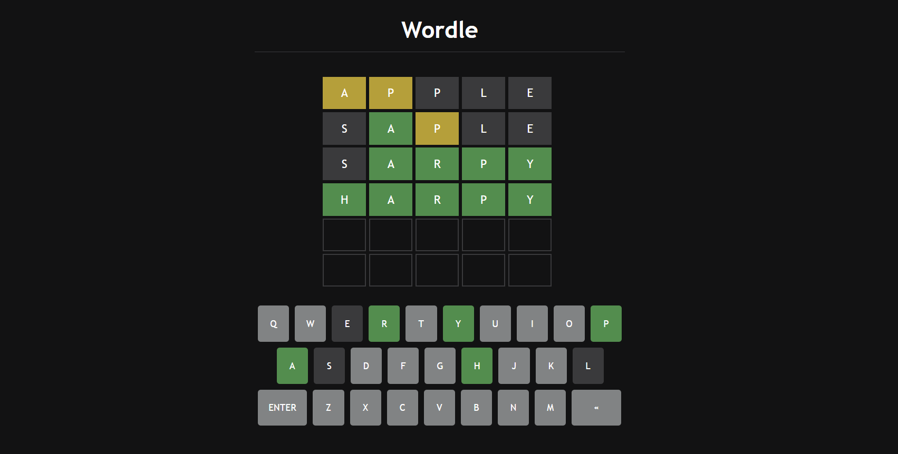

# Wordle-Clone

## Table of contents

- [Overview](#overview)
  - [Screenshot](#screenshot)
  - [Links](#links)
- [My process](#my-process)
  - [Built with](#built-with)
  

## Overview

### Screenshot

### Links

- See what the game looks like and play it [here](https://onanuviie.github.io/Wordle-Clone/)

## My process

### Built with

- Semantic HTML5 markup
- CSS custom properties
- Flexbox
- setTimeout()
- setAttribute()
- getAttribute()
- css Animations
- Array Methods
